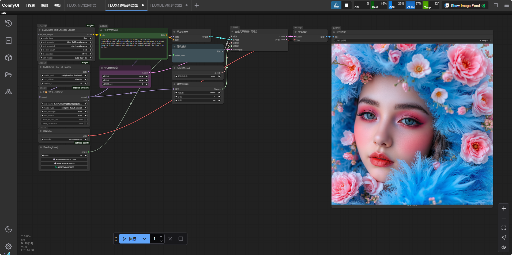
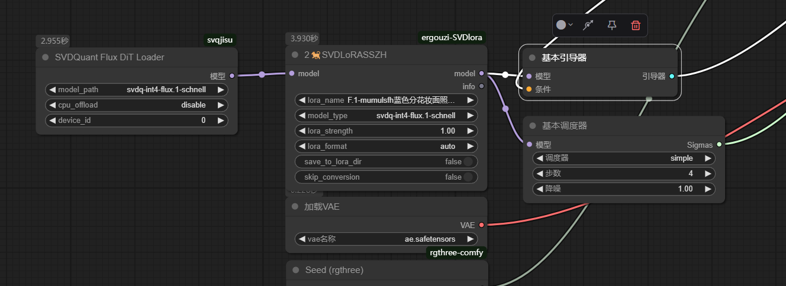

写完才发现，官方3月12号已经支持了，大家可以跟进官方新仓库，此库不再更新
https://github.com/mit-han-lab/ComfyUI-nunchaku
# EGSVD LoRA 工具 / EGSVD LoRA Tools

[English](#english-version) | [中文](#中文版本)

## English Version

### Introduction
EGSVD LoRA Tools is a ComfyUI extension for converting and loading LoRA files with quantized SVD models. It provides a node that allows you to convert and load regular LoRAs to be compatible with quantized SVD models in real-time.

### Features
- Real-time LoRA conversion and loading
- Support for multiple quantized model types
- Adjustable LoRA strength
- Support for different LoRA formats (ComfyUI, Diffusers, XLab)
- Option to save converted LoRAs to cache or original directory

### Installation
1. Make sure you have ComfyUI installed
2. Clone this repository into your ComfyUI custom_nodes directory:
   ```
   cd ComfyUI/custom_nodes
   git clone https://github.com/11dogzi/ComfyUI-ergouzi-SVDlora.git
   ```
3. Need to install first https://github.com/mit-han-lab/nunchaku And ensure that it can operate normally

### Usage

#### 2🐕SVDLoRASSZH Node
This node performs real-time conversion and loading of LoRA files.

Parameters:
- `model`: Diffusion model to apply LoRA to
- `lora_name`: LoRA file to load
- `model_type`: Type of quantized model
- `lora_strength`: Intensity of LoRA effect
- `lora_format`: Format of source LoRA file (auto, comfyui, diffusers, xlab)
- `save_to_lora_dir`: Whether to save converted LoRA to original directory
- `skip_conversion`: Whether to skip conversion (True: use selected model directly, False: follow normal conversion logic)

### Supported Model Types
- svdq-int4-flux.1-dev
- svdq-int4-flux.1-canny-dev
- svdq-int4-flux.1-depth-dev
- svdq-int4-flux.1-fill-dev
- svdq-int4-flux.1-schnell
- svdq-fp4-flux.1-dev
- svdq-fp4-flux.1-schnell

### Notes
- Make sure the quantized model is available in your ComfyUI models directory
- For best results, use LoRAs specifically trained for SVD models

---

## 中文版本

### 简介
EGSVD LoRA 工具是一个 ComfyUI 扩展，用于转换和加载与量化 SVD 模型兼容的 LoRA 文件。它提供了一个节点，可以实时转换和加载常规 LoRA 使其与量化 SVD 模型兼容。

### 特点
- 实时 LoRA 转换和加载
- 支持多种量化模型类型
- 可调节的 LoRA 强度
- 支持不同的 LoRA 格式（ComfyUI、Diffusers、XLab）
- 可选择将转换后的 LoRA 保存到缓存或原始目录

### 安装
1. 确保已安装 ComfyUI
2. 将此仓库克隆到您的 ComfyUI custom_nodes 目录：
   ```
   cd ComfyUI/custom_nodes
   git clone https://github.com/11dogzi/ComfyUI-ergouzi-SVDlora.git
   ```
3. 需要先安装 https://github.com/mit-han-lab/nunchaku 并确保其能够正常运行

### 使用方法

#### 2🐕SVDLoRASSZH 节点
此节点执行 LoRA 文件的实时转换和加载。

参数：
- `model`：要应用 LoRA 的扩散模型
- `lora_name`：要加载的 LoRA 文件
- `model_type`：量化模型类型
- `lora_strength`：LoRA 效果强度
- `lora_format`：源 LoRA 文件格式（auto、comfyui、diffusers、xlab）
- `save_to_lora_dir`：是否将转换后的 LoRA 保存到原始目录
- `skip_conversion`：是否跳过转换（True：直接使用选择的模型，False：按照正常逻辑进行转换）

### 支持的模型类型
- svdq-int4-flux.1-dev
- svdq-int4-flux.1-canny-dev
- svdq-int4-flux.1-depth-dev
- svdq-int4-flux.1-fill-dev
- svdq-int4-flux.1-schnell
- svdq-fp4-flux.1-dev
- svdq-fp4-flux.1-schnell

### 注意事项
- 确保您的 ComfyUI 模型目录中有可用的量化模型
- 为获得最佳效果，请使用专门为 SVD 模型训练的 LoRA


### 使用示例    
### Example usage    
工作流文件有示例工作流    
There are example workflows in the workflow file     
将lora转换节点串联至模型加载之后 ，并选择当前使用的对应型号   
Connect the Lora conversion nodes in series to the model after loading, and select the corresponding model currently in use    
     
     
